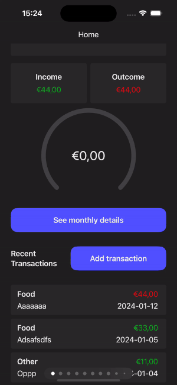
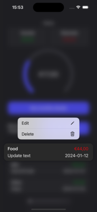
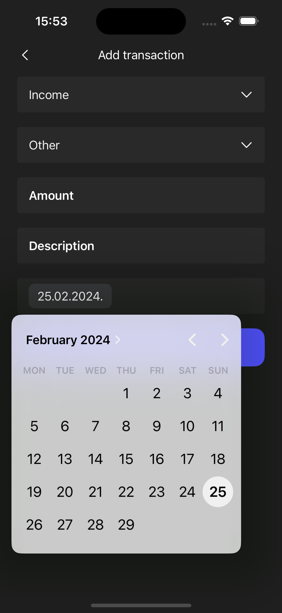
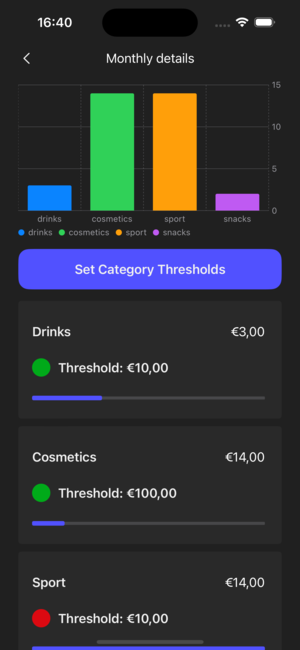

# Expensee

## Description

A streamlined expense management app showcasing SwiftUI, CoreData, Charts, and MVVM Architecture 📲

## Video Demonstration



## Structure
    
    Expensee # Target
    |
    ├── Supporting              # Supporting Files
    │   ├── Assets              # Image Assets and Colors
    │   └── Extensions          # Helper Extensions
    │       ├── ColorExtension  # Color utilities
    │       ├── DoubleExtension # Double type utilities
    │       ├── DateExtension   # Date type utilities
    │       ├── DictionaryExtension # Dictionary utilities
    │       └── IntExtension    # Integer type utilities
    |
    ├── Application             # Application Core
    │   └── ExpenseeApp         # Main App Entry Point
    |
    ├── Common                  # Shared Components
    │   ├── Shape               # Custom Shapes
    │   │   └── ArcShape        # Custom Arc Shape
    │   └── Views               # Reusable Views
    │       ├── CustomNavigationView # Custom Navigation View
    │       ├── PrimaryButtonView    # Primary Button Component
    │       ├── CustomTextFieldView  # Custom Text Field
    │       ├── CustomDropdownView   # Custom Dropdown Picker
    │       ├── ExpenseView          # Expense Display View
    │       ├── ExpensesChartView    # Chart for Visualizing Expenses
    │       └── ExpenseCategoryView  # View for Expense Categories
    |
    ├── Models                  # Data Models
    │   └── ExpenseModel        # Model for Expense Data
    │   └── DataController      # CoreData Controller
    │   └── ExpenseDataModelExtension # Extensions for the Data Model
    |
    ├── Modules                 # Feature Modules
    │   ├── MonthDetails        # Monthly Details Feature
    │   │   ├── MonthDetailsView        # Month Details View
    │   │   └── MonthDetailsViewModel   # View Model for Month Details
    │   ├── Root                # Root View
    │   │   └── RootView                # The Root View
    │   ├── Home                # Home Feature
    │   │   ├── Container               # Container for Home Components
    │   │   │   ├── HomeContainerView   # Home Container View
    │   │   │   └── HomeContainerViewModel # View Model for Home Container
    │   │   ├── Header                  # Header Component
    │   │   │   └── HomeHeaderView        # Home Header View
    │   │   ├── HomeView            # Home View
    │   │   ├── HomeViewModel       # View Model for Home
    │   ├── AddExpense              # Add Expense Feature
    │   │   ├── AddExpenseView      # Add Expense View
    │   │   └── AddExpenseViewModel # View Model for Adding Expense
    
## UI

 |  |  | 

    
## Technologies

- [SwiftUI](https://developer.apple.com/documentation/swiftui/) - SwiftUI is Apple's framework for developing user interfaces across all Apple platforms, utilizing the Swift programming language to optimize for both performance and development efficiency.
- [CoreData](https://developer.apple.com/documentation/coredata) - CoreData provides a framework for managing the model layer objects in an application, offering data persistence, caching, and the ability to implement undo functionality in a consistent manner.
- [Charts](https://developer.apple.com/documentation/charts) - The Charts framework in Swift delivers a suite of tools for creating visual representations of data, facilitating the interpretation and analysis of information.

## License

```
    MIT License

    Copyright (c) 2024 Kristina Matijašić

    Permission is hereby granted, free of charge, to any person obtaining a copy
    of this software and associated documentation files (the "Software"), to deal
    in the Software without restriction, including without limitation the rights
    to use, copy, modify, merge, publish, distribute, sublicense, and/or sell
    copies of the Software, and to permit persons to whom the Software is
    furnished to do so, subject to the following conditions:

    The above copyright notice and this permission notice shall be included in all
    copies or substantial portions of the Software.

    THE SOFTWARE IS PROVIDED "AS IS", WITHOUT WARRANTY OF ANY KIND, EXPRESS OR
    IMPLIED, INCLUDING BUT NOT LIMITED TO THE WARRANTIES OF MERCHANTABILITY,
    FITNESS FOR A PARTICULAR PURPOSE AND NONINFRINGEMENT. IN NO EVENT SHALL THE
    AUTHORS OR COPYRIGHT HOLDERS BE LIABLE FOR ANY CLAIM, DAMAGES OR OTHER
    LIABILITY, WHETHER IN AN ACTION OF CONTRACT, TORT OR OTHERWISE, ARISING FROM,
    OUT OF OR IN CONNECTION WITH THE SOFTWARE OR THE USE OR OTHER DEALINGS IN THE
    SOFTWARE.

```
